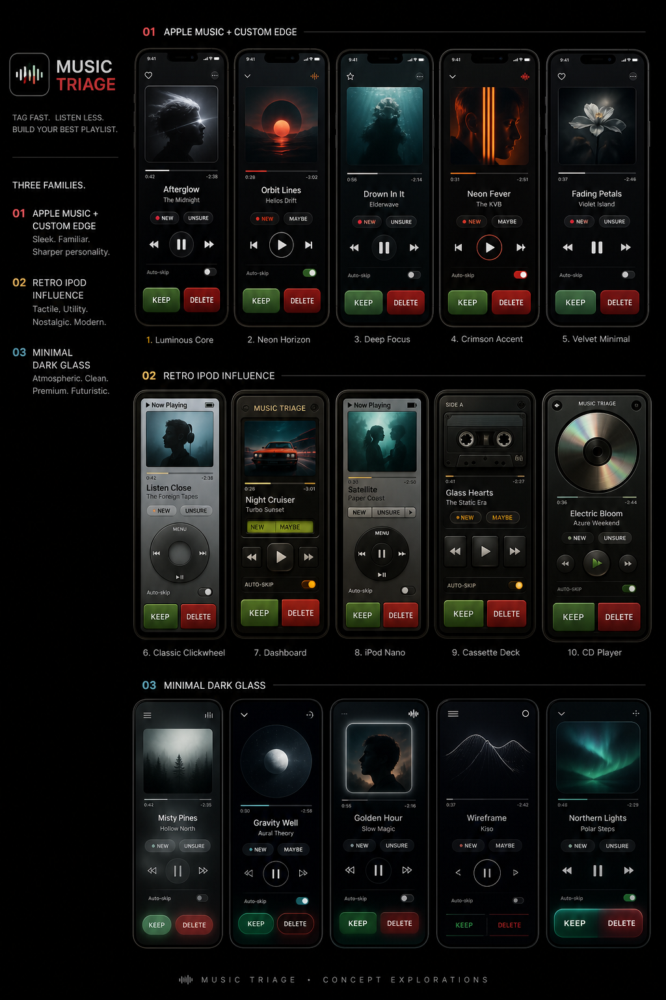

# Music Triage

Music Triage is a personal iPhone app for one very specific job: while Apple Music is already playing, let me mark the current song as `KEEP` or `DELETE` quickly without accidentally acting on the wrong track.

It is intentionally not a player, not a library browser, and not a music-management platform. It is more like a weird little curation appliance.

## Project Status

Active personal project.

Built primarily for my own workflow, but maybe useful to other people with a similarly Apple-centric music setup.

Right now the practical way to use it is from Xcode on a real iPhone.

It is already functional, but still rough around the edges.

## What It Does

- Shows the currently playing Apple Music track.
- Keeps `KEEP` and `DELETE` disabled until the app trusts the current track identity.
- Sends `KEEP` songs to the `Keepers` playlist.
- Sends `DELETE` songs to the `Music Triage` playlist.
- Tries to clean up the opposite playlist automatically as a best-effort follow-up.
- Can auto-skip after tagging if you turn that on.

## Why It Exists

I wanted something for fast music triage while listening that felt calmer and safer than poking around in the Music app itself.

The whole point is this rule:

> Never let the user act on the wrong song.

That means the app would rather hesitate for a moment than confidently tag the wrong track during crossfades, pauses, or weird now-playing transitions.

## Current Visual Direction

The current in-app styling is based on a mix of:

- `Neon Horizon` for the overall dark luminous atmosphere
- `Classic Clickwheel` for the transport/control personality

The first-round design exploration is also documented in [docs/mockups/MOCKUP_REVIEW.md](docs/mockups/MOCKUP_REVIEW.md).

## Running It On A Real iPhone

For now, this is the intended install path.

1. Open `Music Triage.xcodeproj` in Xcode.
2. Connect your iPhone and select it as the run destination.
3. In the `Music Triage` target, go to `Signing & Capabilities`.
4. Set your Team.
5. Keep the bundle identifier as `com.jkfisher.musictriage` unless Xcode forces you to make it unique for your account.
6. Make sure the App ID has the `MusicKit` app service enabled in the Apple Developer portal.
7. If Xcode offers to add the MusicKit capability for the target, accept it.
8. Build and run on the phone.

The app uses `NSAppleMusicUsageDescription` and will ask for Apple Music access only when you first try to tag a song.

## Important Limitations

- This needs a real iPhone to be meaningfully tested. Simulator is not enough for the core behavior.
- Apple Music access, subscription state, and MusicKit/App ID setup still matter a lot.
- `DELETE` in V1 does **not** remove a song from your Apple Music library. It sends the song to the `Music Triage` playlist.
- The app is iPhone-first. iPad is not the priority.
- There is still no polished release/distribution pipeline yet. This is currently a project you run from Xcode.

## Implementation Notes

The repo is split in two useful layers:

- `MusicTriageApp/` contains the iPhone app, MusicKit integration, and UI.
- `Sources/MusicTriageCore/` contains the pure Swift verification/state logic so the most important trust rules can be tested without a full device runtime.

That structure is mostly there to keep the “never tag the wrong song” logic from becoming hand-wavy.

## AI Assistance

Like most of my recent projects, this was built with heavy AI assistance using tools like Codex.

The workflow, decisions, testing priorities, and direction are mine. The typing speed definitely isn’t.
