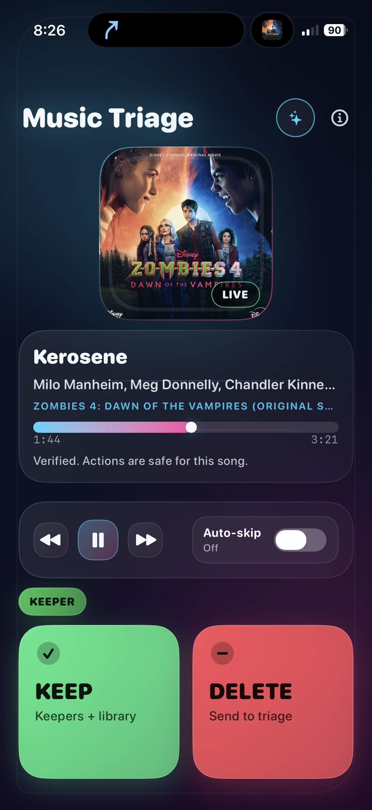

# Music Triage

Music Triage is a personal iPhone app for one very specific job: while Apple Music is already playing, let me mark the current song as `KEEP` or `DELETE` quickly without acting on the wrong track.

It is intentionally not a player, not a library browser, and not a general music-management app. It is more like a small curation appliance for a very Apple-shaped listening workflow.

## Project Status

Basically complete personal project.

Built primarily for my own workflow, but probably useful to other people who also live inside Apple Music.

Right now the intended way to use it is from Xcode on a real iPhone.

The main app shape is in place. I will probably still make tweaks and small updates from time to time.

## What It Does

- Watches the currently playing Apple Music track.
- Keeps `KEEP` and `DELETE` disabled until the app trusts the current track identity.
- Sends `KEEP` songs to the `Keepers` playlist when they are already in your library.
- Switches the left action to yellow `ADD` for trusted Apple Music tracks that are not yet in your library, and that path adds the song to the library only.
- Sends `DELETE` songs to the `Music Triage` playlist.
- Disables `DELETE` for tracks that are not already in your library.
- Tries to clean up the opposite playlist automatically as a best-effort follow-up.
- Can auto-skip after a successful tag if you turn that on.

## Why It Exists

I wanted something faster and calmer than managing this directly inside the Music app.

The whole point is this rule:

> Never let the user act on the wrong song.

That means the app would rather hesitate for a moment than confidently tag the wrong track during crossfades, pauses, or weird now-playing transitions.

## Current App Shape

The live app is a single-screen iPhone UI with:

- album art and now-playing metadata,
- a verification-aware status/help area,
- transport controls,
- an auto-skip toggle,
- membership pills,
- and large hold-to-tag `KEEP` / `DELETE` actions.

The current visual direction is the tighter Neon Horizon version of the UI, not the earlier mockup-board exploration.

## Running It On A Real iPhone

For now, this is the practical install path.

1. Open `Music Triage.xcodeproj` in Xcode.
2. Connect your iPhone and choose it as the run destination.
3. In the `Music Triage` target, open `Signing & Capabilities`.
4. Set your Team.
5. Keep the bundle identifier as `com.jkfisher.musictriage` unless Xcode forces you to use a unique one for your account.
6. Make sure the App ID has the `MusicKit` app service enabled in the Apple Developer portal.
7. If Xcode offers to add the MusicKit capability for the target, accept it.
8. Build and run on the phone.

The app uses `NSAppleMusicUsageDescription` and asks for Apple Music access only when you first try to tag a song.

## Important Limitations

- This needs a real iPhone to be meaningfully tested. Simulator is not enough for the core behavior.
- Apple Music access, subscription state, and MusicKit/App ID setup still matter a lot.
- `DELETE` in V1 does not remove a song from your Apple Music library. It sends the song to the `Music Triage` playlist.
- `DELETE` is intentionally disabled for non-library tracks, and the yellow `ADD` action does not also send those songs to `Keepers`.
- Playlist cleanup is best-effort and may fail on some user-owned playlists even when the primary tag action succeeds.
- The app is iPhone-first. Landscape mode is currently disabled, and iPad is not the priority.
- There is still no polished packaged release flow yet. This is currently a project you run from Xcode.

## Implementation Notes

The repo has two main layers:

- `MusicTriageApp/` contains the iPhone app, MusicKit integration, and UI.
- `Sources/MusicTriageCore/` contains the pure Swift verification and state logic so the trust rules can be tested outside the full app runtime.

That split exists mostly to keep the “never tag the wrong song” logic concrete instead of hand-wavy.

## More Context

- [docs/WHERE_WE_STAND.md](docs/WHERE_WE_STAND.md) is the concise status snapshot.
- [docs/DECISIONS.md](docs/DECISIONS.md) records the important project decisions.

## AI Assistance

Like most of my recent projects, this was built with heavy AI assistance using tools like Codex.

The workflow, decisions, testing priorities, and direction are mine.
